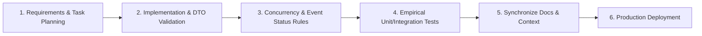

# Development & Audit Workflow — EventHub

> Operational guide for development, feature implementation, code audits, and deployment.

---

## 1. Development Lifecycle



### Step 1: Requirements & Task Planning
- Check open tasks in `task.md`.
- Inspect existing files using `view_file` or `grep_search` to verify method signatures before changing logic.

### Step 2: Implementation & DTO Validation
- Implement feature changes using standard DTO patterns.
- Enforce validation limits (`@NotBlank`, `@Size`, `@Min`, `@Max`, `@NotNull`, `@DateTimeFormat`).
- Validate temporal constraints (`endDate` > `eventDate`).

### Step 3: Concurrency, Event Status & Change Notifications
- For any resource mutation with limited capacity (e.g. event registration), apply `@Lock(LockModeType.PESSIMISTIC_WRITE)` and atomic database increment operations.
- Dynamically compute `@Transient` `EventStatus` (`UPCOMING`, `ONGOING`, `ENDED`).
- Enforce user self-attendance check-in (`POST /events/{id}/attend`) strictly during the `ONGOING` phase.
- Trigger asynchronous email notifications (`EmailService.sendEventUpdateNotification`) detailing exact field modifications when an event is updated by an admin.
- Restrict admin user management to role-only updates (`ROLE_USER` ↔ `ROLE_ADMIN`).
- Handle `DataIntegrityViolationException`, `IllegalArgumentException`, and `IllegalStateException` in `GlobalExceptionHandler.java`.

### Step 4: Empirical Testing & Verification
- Execute test command:
  ```bash
  ./mvnw test -Dspring.profiles.active=test
  ```
- Ensure zero test failures or errors before proceeding (`BUILD SUCCESS`).

### Step 5: Document Synchronization
- Record any developer mistakes, root causes, and solutions in `.agent/context.md`.
- Keep `.agent/agent.md`, `documents/build-guide.md`, `documents/feature-guide.md`, and `code_audit_report.md` up to date with the latest architectural changes.

### Step 6: Production Deployment
- Verify Flyway database schema migrations (`V1__init_schema.sql`, `V2__add_end_date_to_events.sql`).
- Verify Docker containerization (`Dockerfile`) and standard environment variables.
- Deploy to cloud providers using environment configuration files.

---

## 2. Testing & Quality Assurance Checklist

- [x] All 17 automated tests passing (`RegistrationServiceTest`, `EventServiceTest`, `UserServiceTest`, `EventControllerTest`, `EventManagementSystemApplicationTests`).
- [x] Concurrency locking verified for capacity limits.
- [x] PostgreSQL string and date parameters safely cast in JPQL queries.
- [x] Flyway migrations `V1` and `V2` verified.
- [x] Dynamic `EventStatus` calculation verified (`UPCOMING`, `ONGOING`, `ENDED`).
- [x] User self-attendance check-in restricted to `ONGOING` events.
- [x] Asynchronous event detail change email notifications active for registered users.
- [x] Admin user edits constrained to role-only modifications (`ROLE_USER` ↔ `ROLE_ADMIN`).
- [x] Removed obsolete configuration files (`render.yaml`).
- [x] Thymeleaf templates escaped to prevent XSS.
- [x] CSRF protection active on all POST/PUT/DELETE forms.
